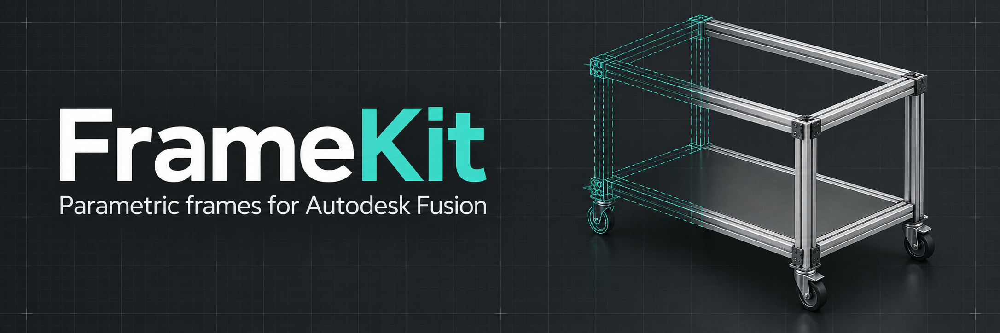

# FrameKit

**Deutsch** | [English](README.en.md)

FrameKit ist ein geplantes Add-in für Autodesk Fusion, das aus Dialogeingaben ein verschraubtes Untergestell oder einen einfachen Transportwagen aus Alu-Nutprofilen erzeugt. Vor der Bauteilerstellung lässt sich die Konstruktion anhand einer räumlichen Mittellinien-Vorschau prüfen.

## Projektstatus

Die Integrationsdemo (**0.4.4**) liegt unter [`fusion_addin/FrameKit`](fusion_addin/FrameKit) vor. Sie bietet drei Dialogreiter, speicherbare Standardwerte und die Erstellung eines Gestells aus Demo-Vollprofilen oder eigenen DXF-Profilen mit optionalen Zwischenböden und anschließendem „Zoom auf alles“. Füße und Rollen sind als Zylinderplatzhalter auswählbar; eigene Varianten lassen sich speichern und löschen. Jeder Rahmen erhält eine Platte; die Deckplatte kann wahlweise ohne Aussparungen auf den Profilen montiert werden. Bodenanzahl, Einzelhöhen und Plattenstärke sind einstellbar; leere Höhen werden gleichmäßig verteilt. Zum Laden und Testen sowie zum aktuellen Prüfstand siehe [Demo-Anleitung](docu/demo_installation.md). Die folgenden Funktionen beschreiben den geplanten vollständigen Umfang.

Neu in **0.3.0**: lokale DXF-Profilbibliothek mit Importprüfung, Maßbestätigung, Auswahl und Löschen. Quadratische Querschnitte mit Mittelpunkt im Ursprung werden einschließlich Nuten und Hohlräumen extrudiert. Unterstützte DXF-Elemente, Speicherort und Fusion-Prüfschritte: [Profilbibliothek und DXF-Import](docu/profilbibliothek_dxf.md). Querträger und wählbare Deckplattenmontage aus 0.2.1 bleiben enthalten.

Neu in **0.3.1 (S05)**: getrennte Profile für Pfosten, Rahmen und Querträger, abweichende Profile je Ebene und rechteckige DXF-Querschnitte mit Vierteldrehungen. Zuschnitte, Plattenaussparungen und Bodenabstände berücksichtigen die tatsächlichen Profilmaße. Siehe [Profile je Bauteilgruppe](docu/profile_je_bauteilgruppe.md). Die Versionen **0.2.0, 0.2.1 und 0.3.0** funktionieren laut Benutzerprüfung vom 26.09.2026; auch 0.3.1 wurde am 26.09.2026 als funktionsfähig bestätigt.

Neu in **0.4.0 (S06)**: Vorbelegung für Untergestell/Transportwagen, einzelne Fuß-/Rollenauswahl je Ecke sowie Zubehör bearbeiten und duplizieren. Unterschiedliche Bauhöhen sperren die Erstellung. Alle Ausklappbereiche starten geschlossen, bei geringerer Anfangshöhe des Dialogfensters. Zubehör bleibt als Zylinderplatzhalter mit Brems-, Verstell- und Montageeigenschaften dargestellt. Siehe [Bauart und Zubehöranordnung](docu/bauart_zubehoer.md). Version 0.4.0 läuft laut Benutzerprüfung vom 26.09.2026 ohne Fehler.

Neu in **0.4.1**: farbige Fehler und Warnhinweise in allen Dialogbereichen. Beim Einschalten der Vorschau wird das vollständige Gestell einschließlich Zubehörüberständen im Ansichtsbereich eingepasst; spätere Eingabeänderungen behalten manuelles Zoomen bei. Winkelregeln sind für den nächsten Schritt vorgemerkt. Fusion-Prüfung offen. Siehe [Dialoghinweise und Vorschau](docu/dialoghinweise_vorschau.md).

Neu in **0.4.3**: Die bereitgestellten STEP-Winkel 20/30/40 mm ersetzen die Dreieckplatzhalter. Pro Größe wird eine Komponente mehrfach platziert, mit Auflage an den Profilaußenflächen und gemeinsamer Sichtbarkeitsgruppe **91 | Winkel**. Die Vorschau zeigt Montagehüllen in Originalgröße. Zubehörfehler erscheinen zusätzlich direkt unter der Fuß-/Rollenauswahl. [Winkel und Prüfschritte](docu/winkel.md); am 26.09.2026 vom Benutzer als funktionsfähig in Fusion bestätigt.

Neu in **0.4.4**: Dialogaktualisierung gegen Cursorversatz beim Tippen korrigiert (gemeldet: `600` erscheint als `006`). Unveränderte Feldzustände und Hinweise werden nicht erneut geschrieben; die Eingabeprüfung verändert keine Dialogfelder. 110 lokale Tests erfolgreich, Bestätigung im laufenden Fusion noch offen.

## Screenshots

### Version 0.3.0

Vom Benutzer am 26.09.2026 erfolgreich getestet. Die Aufnahmen zeigen unterschiedliche Eingabestände.

Erzeugtes Gestell mit DXF-Profilen, drei Platten und zylindrischen Zubehörplatzhaltern.

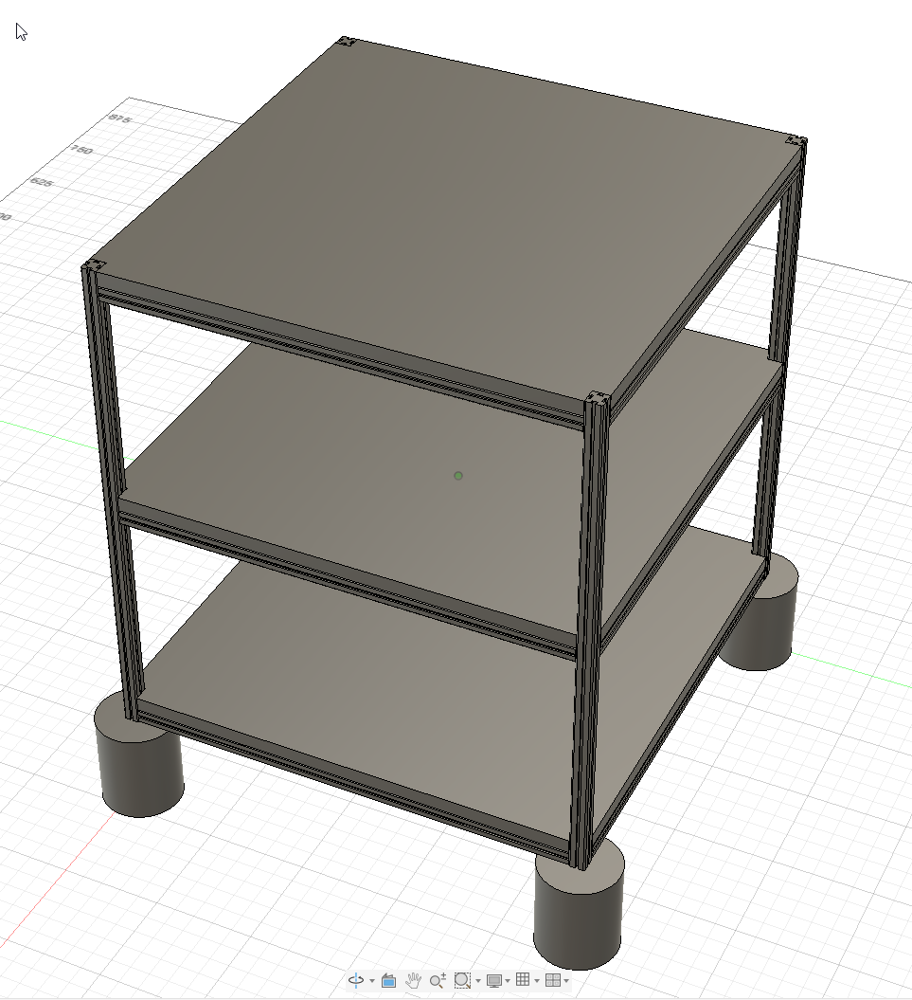

Weitere Ansichten aus Version 0.3.0

Baugruppenstruktur mit eingefürbten Komponenten, Querträgern und transparenten Platten.

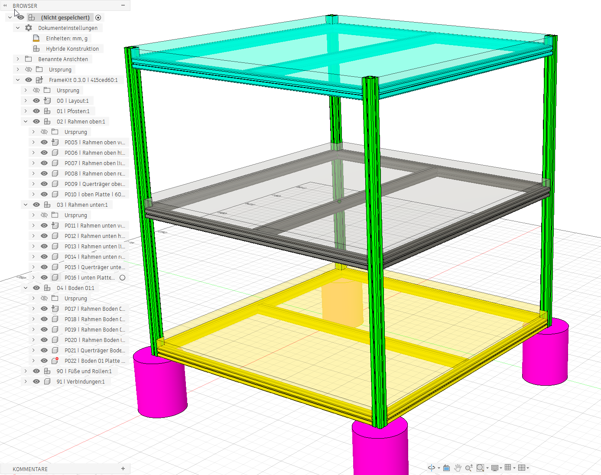

Mittellinien-Vorschau mit Bodenflächen, Zubehörumrissen und Querträgereinstellungen.

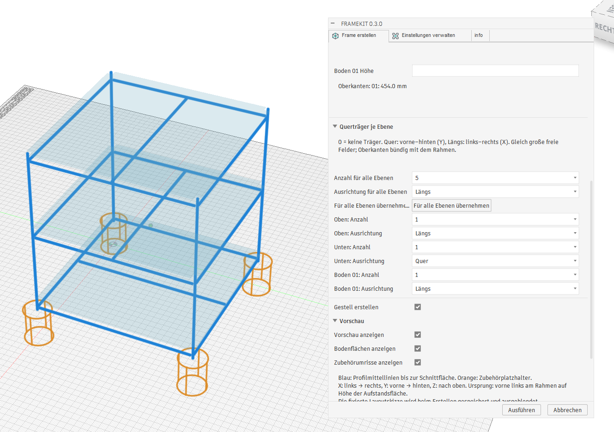

Erstellungsdialog mit Deckplattenmontage, Querträgern je Ebene und Vorschauoptionen.

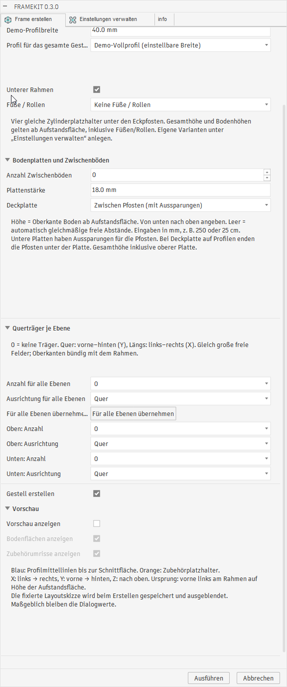

Einstellungen mit gespeichertem DXF-Profil 20 × 20 mm und Zubehörbibliothek.

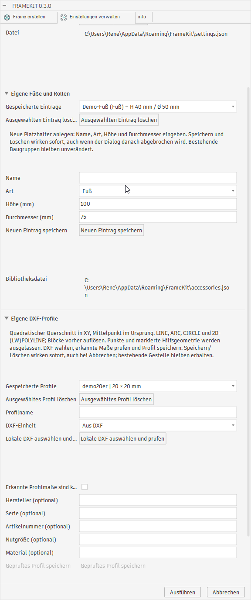

Historischer Import-Prüfstand: POINT-Fehlermeldung während des Tests. Punkte und markierte Hilfsgeometrie werden inzwischen ausgelassen.

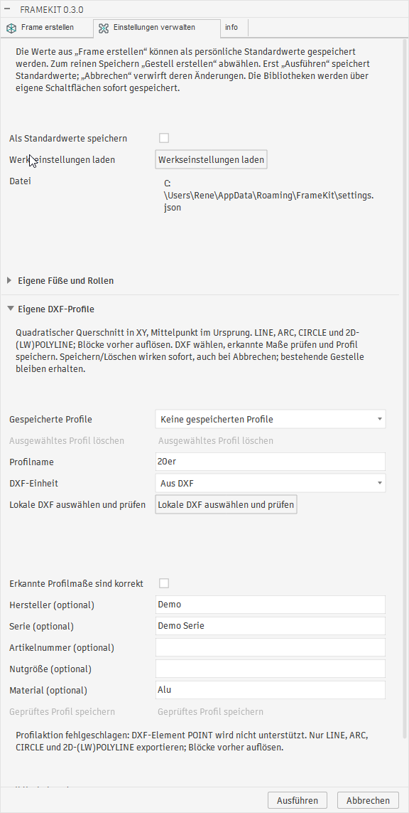

### Version 0.1.5

Alle folgenden Aufnahmen gehören zum Bildsatz **0.1.5**. Die Dialoge zeigen unterschiedliche Eingabestände und müssen nicht den Werten des abgebildeten Gestells entsprechen. Weitere Versionen werden als eigene Bildsätze geführt; siehe [Screenshot-Ablage](images/screenshots/README.md).

<!-- Screenshot-Satz 0.1.5: Nur Bilder aus images/screenshots/0.1.5/ verwenden. Neue Versionen separat gruppieren. -->

**Gestell und Bedienoberfläche:** Beispiel mit aufliegenden Bodenplatten, Eckausklinkungen und zylindrischen Fuß-/Rollenplatzhaltern neben dem Erstellungsdialog.

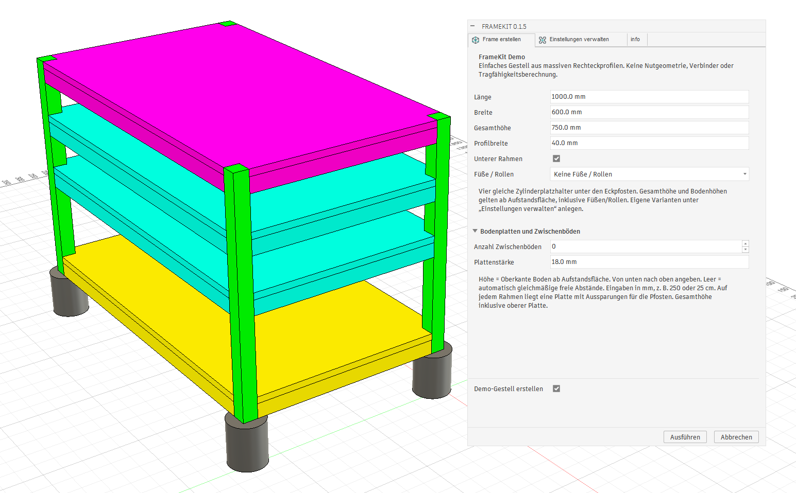

Weitere Ansichten aus Version 0.1.5: Dialog, Einstellungen, Baugruppenstruktur und Info

**Frame erstellen:** Abmessungen, Profilbreite, Zubehör und Zwischenböden konfigurieren. Bei leerer Höhenangabe wird die berechnete Bodenhöhe angezeigt.

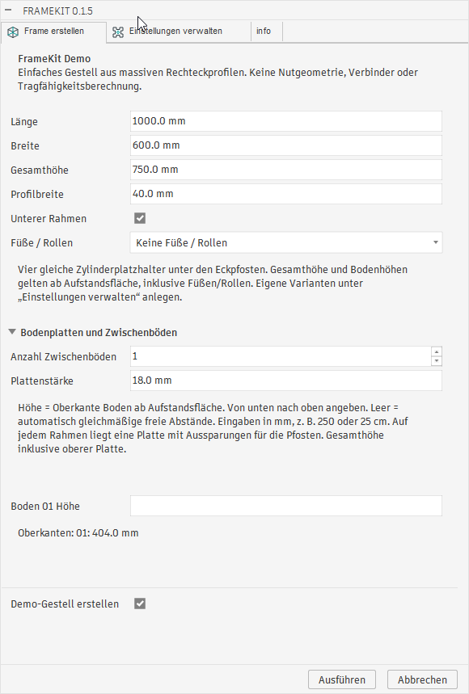

**Einstellungen verwalten:** Persönliche Standardwerte speichern und eigene Fuß-/Rollenplatzhalter mit Name, Art, Höhe und Durchmesser anlegen oder löschen.

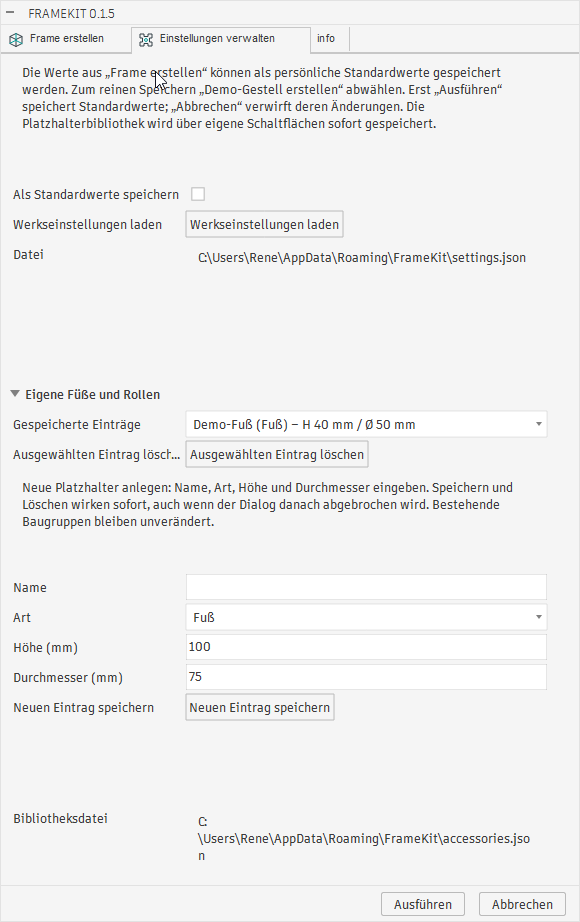

**Baugruppenstruktur:** Der Fusion-Browser gliedert das Gestell in Pfosten, Rahmen, Bodenebenen und Zubehör. Die Verbindungsgruppe ist für den späteren Ausbau reserviert.

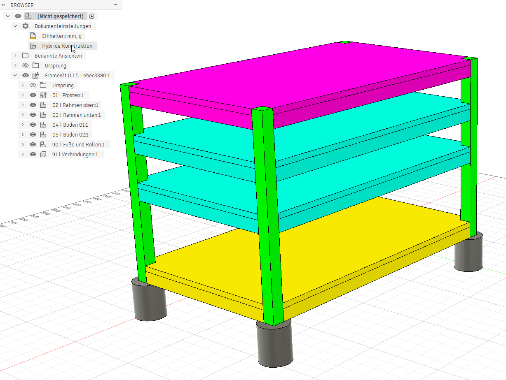

**Info:** Versionsanzeige, FrameKit-Logo und Links zu Homepage, Quellcode, Releases und Support.

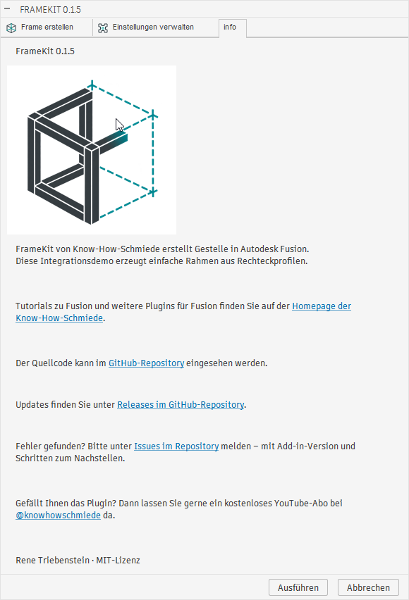

## Geplanter Funktionsumfang

- **Gestelle und Transportwagen:** Vier durchgehende Eckpfosten, ein oberer Rahmen und ein optionaler unterer Rahmen mit verschraubten Verbindungen.
- **Konfigurierbare Abmessungen:** Länge, Breite und Gesamthöhe sowie gemeinsame oder unterschiedliche Profile für Pfosten und Träger.
- **Zwischenböden und Querträger:** Bodenebenen mit Platten und umlaufendem Tragrahmen; Querträger werden unter Berücksichtigung ihrer Breite gleichmäßig verteilt.
- **Füße und Rollen:** Feste oder höhenverstellbare Füße, Lenkrollen mit optionaler Bremse, Bockrollen und absenkbare Rollen nach einem noch festzulegenden Referenztyp.
- **Erweiterbare Profilbibliothek:** Eigene DXF-Querschnitte mit Metadaten wie Hersteller, Serie, Artikelnummer, Nutgröße, Material und kompatiblen Verbindungssätzen – ohne Programmänderung. Importprüfungen kontrollieren Maßstab, geschlossene Konturen und Hohlräume.
- **3D-Vorschau und Eingabeprüfung:** Profilmittellinien mit Enden an den tatsächlichen Schnittflächen; ungültige Eingaben verhindern die Erstellung und werden verständlich erklärt.
- **Strukturierte Fusion-Baugruppen:** Jedes Profil erhält eine eigene Komponente mit stabiler ID, aussagekräftigem Namen, Bauteileigenschaften und benannten Zeitleistengruppen.
- **Gespeicherte Konfiguration:** Gestelle lassen sich über den Dialog erneut öffnen und kontrolliert neu aufbauen.
- **CSV-Export:** Gruppierte Zuschnittlisten mit Profil, Länge, Menge und Bauteil-IDs sowie Stücklisten einschließlich Platten, Füßen, Rollen und definierten Verbindungssätzen.

## Vorgesehener Ablauf

1. Bauart wählen und Abmessungen, Profile, Böden, Querträger sowie Füße oder Rollen konfigurieren.
2. Mittellinien-Vorschau anzeigen und die Konstruktion prüfen.
3. Gestell als strukturierte Fusion-Baugruppe erzeugen.
4. Bei Bedarf die gespeicherte Konfiguration bearbeiten und das Gestell neu aufbauen.
5. Zuschnitt- und Stücklisten als CSV exportieren.

Vorschau, Bauteilerstellung und Listen sollen dieselben berechneten Bauteildaten verwenden. Die Berechnungslogik wird von der Fusion-Geometrieerstellung getrennt.

## Konstruktionsregeln und Grenzen der ersten Version

Länge und Breite bezeichnen die Außenmaße des Profilrahmens; Rollenüberstände zählen nicht dazu. Die Gesamthöhe reicht von der Aufstandsfläche bis zur definierten Oberkante einschließlich einer gegebenenfalls aufliegenden Deckplatte. Profilquerschnitte, Plattenstärken, Zubehörbauhöhen und Montageabstände fließen in die Berechnung ein.

Die erste Version ist für gerade Profilzuschnitte vorgesehen. Das Referenzprofil, die Verbindungssätze, die Plattenauflage und der Referenztyp absenkbarer Rollen müssen vor der Umsetzung konkret festgelegt werden.

- Dialog und gespeicherte Konfiguration bleiben maßgeblich; manuelle Änderungen an Layoutskizzen werden nicht als Eingaben übernommen.
- Manuelle Änderungen an generierten Bauteilen bleiben beim Neuaufbau nicht erhalten. Andere, nicht vom Add-in verwaltete Komponenten bleiben unberührt.
- Externe Referenzen auf neu erzeugte Flächen werden nicht zugesichert.
- Verbindungsteile können nur bei hinterlegten Montage- und Mengenregeln vollständig in der Stückliste erscheinen; fehlende Zuordnungen werden gekennzeichnet.
- Eine statische Tragfähigkeitsberechnung ist nicht enthalten. Die Querträgerverteilung setzt geometrische Benutzervorgaben um.

## Umsetzungsetappen

1. **Grundprototyp:** Referenzprofil, vier Pfosten, oberer Rahmen, Dialog und Mittellinien-Vorschau.
2. **Profilbaugruppe:** DXF-Extrusion, Benennung, Eigenschaften und Zeitleistengruppen.
3. **Böden und Querträger:** Ebenen, Platten und gleichmäßige Abstützung.
4. **Zubehör:** Füße, Rollen und konkrete Verbindungssätze.
5. **Projektbearbeitung und Export:** Konfiguration laden, kontrollierter Neuaufbau und CSV-Listen.
6. **Abnahme:** Prüfungen in Fusion, Beispieldateien sowie Installations- und Bibliotheksanleitung.

Geplant sind gezielte Tests der Berechnungslogik sowie separate Prüfungen in Fusion. Dabei sollen insbesondere Maße, Profilhohlräume, die Übereinstimmung von Vorschau und Baugruppe, Exportmengen und das erneute Öffnen der Konfiguration geprüft werden.

Spätere Erweiterungen umfassen unter anderem weitere Rahmenformen, individuelle Querträgerpositionen, eine Querträgeranzahl anhand einer maximalen freien Spannweite, Griffbügel, Diagonalstreben, zusätzliche Importformate und die Zuschnittoptimierung für Lagerstangen.

## Dokumentation

- [Ablaufplan und Versionen](docu/ablaufplan.md) – bearbeitbarer Plan und Status der Umsetzung.
- [Vorschau und Layout](docu/vorschau_layout.md) – Anzeigeoptionen, Orientierung und fixierte Layoutskizze ab 0.2.0.
- [Bauteildaten und Baugruppenstruktur](docu/bauteildaten.md) – stabile IDs, Eigenschaften und Fusion-Zeitleiste ab 0.1.5.
- [Änderungshistorie](docu/timeline.md) – bisherige Änderungen und aktueller Prüfstand.
- [Demo installieren und testen](docu/demo_installation.md) – Dialog, Icons, Versionierung und Fusion-Prüfschritte.
- [Projektplan](docu/projektplan_FrameKit.md) – vollständige Anforderungen, Konstruktionsregeln, Umsetzungsschritte und Abnahmekriterien.
- [Branding und Grafikressourcen](images/README.md) – Informationen zu Logo, GitHub-Banner und Fusion-Befehlssymbolen (Englisch).
- [English README](README.en.md) – englische Projektübersicht.

## Lizenz

Die Lizenzbedingungen stehen in [LICENSE](LICENSE).
